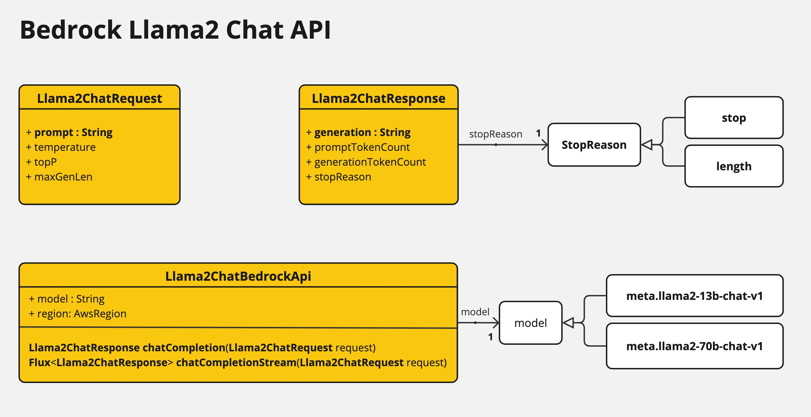

# 1. Bedrock Llama2

Provides Bedrock Llama2 Chat API and Spring-AI chat clients.

## 1.1 Llama2ChatBedrockApi

[Llama2ChatBedrockApi](./src/main/java/org/springframework/ai/bedrock/llama2/api/Llama2ChatBedrockApi.java) provides is lightweight Java client on top of AWS Bedrock [Meta Llama 2 and Llama 2 Chat models](https://docs.aws.amazon.com/bedrock/latest/userguide/model-parameters-meta.html).

Following class diagram illustrates the Llama2ChatBedrockApi interface and building blocks:



The Llama2ChatBedrockApi supports the `meta.llama2-13b-chat-v1` and `meta.llama2-70b-chat-v1` models.

Also the Llama2ChatBedrockApi supports both synchronous (e.g. `chatCompletion()`) and streaming (e.g. `chatCompletionStream()`) responses.

Here is a simple snippet how to use the api programmatically:

```java
Llama2ChatBedrockApi llama2ChatApi = new Llama2ChatBedrockApi(
			Llama2ChatCompletionModel.LLAMA2_70B_CHAT_V1.id(),
			Region.US_EAST_1.id());

Llama2ChatRequest request = Llama2ChatRequest.builder("Hello, my name is")
		.withTemperature(0.9f)
		.withTopP(0.9f)
		.withMaxGenLen(20)
		.build();

Llama2ChatResponse response = llama2ChatApi.chatCompletion(request);

System.out.println(response.generation());

// Streaming response
Flux<Llama2ChatResponse> responseStream = llama2ChatApi.chatCompletionStream(request);

List<Llama2ChatResponse> responses = responseStream.collectList().block();

System.out.println(responses);
```

Follow the [Llama2ChatBedrockApi.java](./src/main/java/org/springframework/ai/bedrock/llama2/api/Llama2ChatBedrockApi.java)'s JavaDoc for further information.

## 1.2 BedrockLlama2ChatClient

[BedrockLlama2ChatClient](./src/main/java/org/springframework/ai/bedrock/llama2/BedrockLlama2ChatClient.java) implements the Spring-Ai `AiClient` and `AiStreamingClient` on top of the `Llama2ChatBedrockApi`.

You can use like this:

```java
@Bean
public Llama2ChatBedrockApi llama2Api() {
	return new Llama2ChatBedrockApi(
		Llama2ChatCompletionModel.LLAMA2_70B_CHAT_V1.id(),
		EnvironmentVariableCredentialsProvider.create(),
		Region.US_EAST_1.id(),
		new ObjectMapper());
}

@Bean
public BedrockLlama2ChatClient llama2ChatClient(Llama2ChatBedrockApi llama2Api) {
	return new BedrockLlama2ChatClient(llama2Api);
}
```

or you can leverage the `spring-ai-bedrock-ai-spring-boot-starter` Spring Boot starter:

```xml
<dependency>
	<artifactId>spring-ai-bedrock-ai-spring-boot-starter</artifactId>
	<groupId>org.springframework.ai</groupId>
    <version>0.8.0-SNAPSHOT</version>
</dependency>
```

And set `spring.ai.bedrock.llama2.chat.enabled=true`.
By default the client is disabled.

Use the `BedrockLlama2ChatProperties` to configure the Bedrock Llama2 Chat client:

| Property  | Description | Default |
| ------------- | ------------- | ------------- |
| spring.ai.bedrock.aws.region  | AWS region to use.  | us-east-1 |
| spring.ai.bedrock.aws.accessKey  | AWS credentials access key.  |  |
| spring.ai.bedrock.aws.secretKey  | AWS credentials secret key.  |  |
| spring.ai.bedrock.llama2.chat.enable | Enable Bedrock Llama2 chat client. Disabled by default | false |
| spring.ai.bedrock.llama2.chat.temperature  | Controls the randomness of the output. Values can range over [0.0,1.0]  | 0.7 |
| spring.ai.bedrock.llama2.chat.topP  | The maximum cumulative probability of tokens to consider when sampling.  | AWS Bedrock default |
| spring.ai.bedrock.llama2.chat.maxGenLen  | Specify the maximum number of tokens to use in the generated response. | 300 |
| spring.ai.bedrock.llama2.chat.model  | The model id to use. See the `Llama2ChatCompletionModel` for the supported models.  | meta.llama2-70b-chat-v1 |

